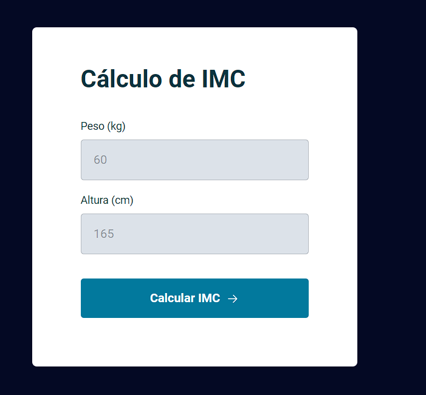

<h1 align="center"> Cálculo de IMC </h1>

Evento exclusivo , promovido pela Rocketseat para ensino de tecnologias WEB.

  <a href="#-tecnologias">Tecnologias</a>&nbsp;&nbsp;&nbsp;|&nbsp;&nbsp;&nbsp;
  <a href="#-projeto">Projeto</a>&nbsp;&nbsp;&nbsp;|&nbsp;&nbsp;&nbsp;
  <a href="#-layout">Layout</a>&nbsp;&nbsp;&nbsp;|&nbsp;&nbsp;&nbsp;
  <a href="#-aprendizado">Aprendizado</a>&nbsp;&nbsp;&nbsp;|&nbsp;&nbsp;&nbsp;
  <a href="#memo-licença">Licença</a>

  

 

  

## 🚀 Tecnologias

Esse projeto foi desenvolvido com as seguintes tecnologias:

- HTML e CSS
- JavaScript
- Git e GitHub

## 💻 Projeto

Esse projeto realiza o cálculo de IMC do usuário ao inserir o seu peso e sua altura nos inputs. O cálculo do IMC funciona da seguinte maneira, tem que dividir o peso pela a altura e elevar ao quadrado. 

## 🔖 Layout

Você pode visualizar o layout do projeto através [DESSE LINK](https://www.figma.com/file/atKbLPvU3Ell5kKPtzEXPc/IMC/duplicate?node-id=6%3A4). É necessário ter conta no [Figma](https://figma.com) para acessá-lo.  

## 🧠 Aprendizado

Nesse projeto eu aprendi;

- Introdução ao ES6 Modules.
- Manipulação com a DOM.
- Eventos.
- Funções CallBack.
- Refatoração de código
- Clean Code

## :memo: Licença

Esse projeto está sob a licença MIT.

---
